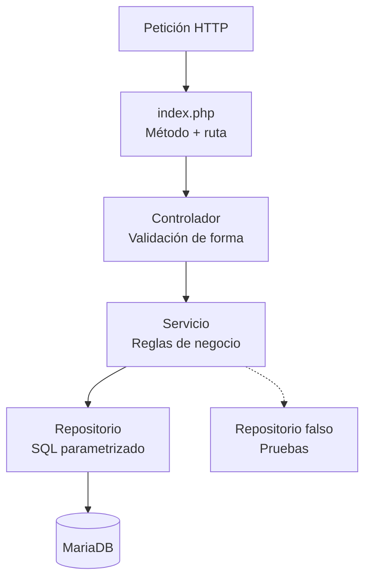
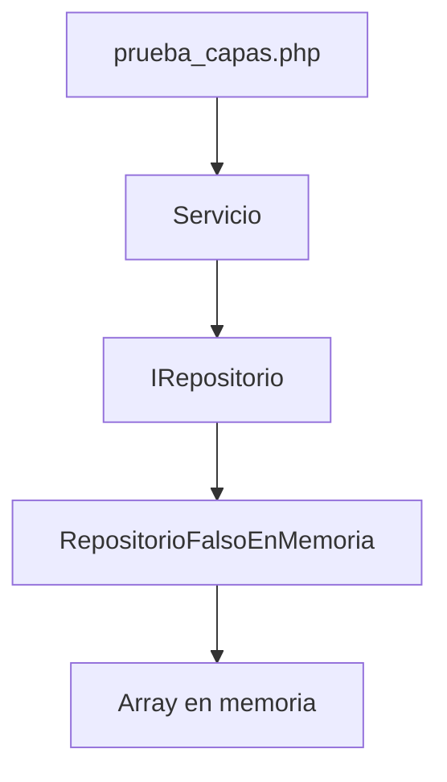

# Plan técnico — v1: Catálogos de Investigación (PHP + MariaDB)

## 1. Estructura del proyecto

El proyecto estará dividido en dos repositorios privados:

```text
api_investigacion/
└── API

front_investigacion/
└── Frontend
```

La API será responsable de:

- Recibir peticiones HTTP.
- Validar la estructura de los datos recibidos.
- Aplicar las reglas de negocio.
- Ejecutar las consultas SQL.
- Comunicarse con MariaDB.
- Devolver respuestas JSON.

El Frontend será responsable de:

- Mostrar las interfaces al usuario.
- Mostrar formularios.
- Validar información básica antes de enviarla.
- Consumir la API.
- Mostrar resultados, errores y mensajes de operación.
- Utilizar Bootstrap para la interfaz.

---

## 2. Árbol de la API

La estructura propuesta para la API es:

```text
api_investigacion/
├── index.php
│
├── controladores/
│   ├── ControladorAreaConocimiento.php
│   ├── ControladorObjetivoDesarrolloSostenible.php
│   ├── ControladorAreaAplicacion.php
│   ├── ControladorTerminoClave.php
│   ├── ControladorUniversidad.php
│   └── ControladorLineaInvestigacion.php
│
├── servicios/
│   ├── IServicioAreaConocimiento.php
│   ├── ServicioAreaConocimiento.php
│   ├── IServicioObjetivoDesarrolloSostenible.php
│   ├── ServicioObjetivoDesarrolloSostenible.php
│   ├── IServicioAreaAplicacion.php
│   ├── ServicioAreaAplicacion.php
│   ├── IServicioTerminoClave.php
│   ├── ServicioTerminoClave.php
│   ├── IServicioUniversidad.php
│   ├── ServicioUniversidad.php
│   ├── IServicioLineaInvestigacion.php
│   ├── ServicioLineaInvestigacion.php
│   └── ensamblador.php
│
├── repositorios/
│   ├── IRepositorioAreaConocimiento.php
│   ├── RepositorioAreaConocimientoMariaDB.php
│   ├── IRepositorioObjetivoDesarrolloSostenible.php
│   ├── RepositorioObjetivoDesarrolloSostenibleMariaDB.php
│   ├── IRepositorioAreaAplicacion.php
│   ├── RepositorioAreaAplicacionMariaDB.php
│   ├── IRepositorioTerminoClave.php
│   ├── RepositorioTerminoClaveMariaDB.php
│   ├── IRepositorioUniversidad.php
│   ├── RepositorioUniversidadMariaDB.php
│   ├── IRepositorioLineaInvestigacion.php
│   └── RepositorioLineaInvestigacionMariaDB.php
│
├── modelos/
│   ├── AreaConocimiento.php
│   ├── ObjetivoDesarrolloSostenible.php
│   ├── AreaAplicacion.php
│   ├── TerminoClave.php
│   ├── Universidad.php
│   └── LineaInvestigacion.php
│
├── excepciones/
│   ├── NoEncontradoExcepcion.php
│   ├── ConflictoExcepcion.php
│   └── ValidacionExcepcion.php
│
├── configuracion/
│   └── ConexionMariaDB.php
│
├── pruebas/
│   ├── prueba_area_conocimiento.php
│   ├── prueba_objetivo_desarrollo_sostenible.php
│   ├── prueba_area_aplicacion.php
│   ├── prueba_termino_clave.php
│   ├── prueba_universidad.php
│   └── prueba_linea_investigacion.php
│
├── .env
├── .env.example
├── .gitignore
└── README.md
```

---

## 3. Responsabilidad de cada carpeta

### 3.1 `index.php`

Será el punto de entrada de la API.

Su responsabilidad será:

- Leer el método HTTP.
- Leer la ruta solicitada.
- Identificar el recurso.
- Identificar el identificador cuando exista.
- Enviar la petición al controlador correspondiente.

No debe contener:

- SQL.
- Reglas de negocio.
- Consultas a MariaDB.
- Validaciones complejas.

Flujo:

```text
Petición HTTP
      ↓
   index.php
      ↓
Controlador
```

---

## 4. Controladores

Los controladores estarán ubicados en:

```text
controladores/
```

Existirá un controlador por cada tabla de v1.

Ejemplo:

```text
ControladorAreaConocimiento.php
```

El controlador será responsable de:

- Recibir la petición HTTP.
- Leer parámetros.
- Leer el cuerpo JSON.
- Validar la forma de los datos.
- Convertir errores de validación en respuestas HTTP.
- Invocar el servicio correspondiente.
- Convertir excepciones de negocio en códigos HTTP.
- Generar la respuesta JSON.

El controlador **no debe contener SQL**.

Tampoco debe contener las reglas principales de negocio.

---

## 5. Servicios

Los servicios estarán ubicados en:

```text
servicios/
```

Cada entidad tendrá:

```text
IServicioEntidad.php
ServicioEntidad.php
```

Ejemplo:

```text
IServicioAreaConocimiento.php
ServicioAreaConocimiento.php
```

El servicio será responsable de:

- Aplicar las reglas de negocio.
- Validar reglas relacionadas con la entidad.
- Coordinar las operaciones del repositorio.
- Lanzar excepciones de negocio.

El servicio **no debe conocer HTTP**.

Por lo tanto, dentro de los servicios no se deben utilizar:

```text
$_SERVER
http_response_code()
header()
```

ni códigos HTTP.

El servicio debe poder funcionar aunque no exista una petición web.

---

## 6. Ensamblador

El archivo:

```text
servicios/ensamblador.php
```

será el único lugar donde se crearán las implementaciones concretas de las dependencias principales.

Su responsabilidad será conectar:

```text
Controlador
     ↓
Interfaz de Servicio
     ↓
Servicio concreto
     ↓
Interfaz de Repositorio
     ↓
Repositorio MariaDB
```

Esto permite evitar que los controladores creen directamente objetos concretos.

---

## 7. Repositorios

Los repositorios estarán ubicados en:

```text
repositorios/
```

Cada tabla tendrá:

```text
IRepositorioEntidad.php
RepositorioEntidadMariaDB.php
```

Ejemplo:

```text
IRepositorioAreaConocimiento.php
RepositorioAreaConocimientoMariaDB.php
```

El repositorio será el único componente que conocerá:

- PDO.
- MariaDB.
- SQL.
- Prepared statements.

El resto de capas no debe ejecutar SQL directamente.

---

## 8. Modelos

Los modelos estarán ubicados en:

```text
modelos/
```

Cada tabla tendrá una clase correspondiente.

Ejemplo:

```php
class AreaConocimiento
{
    private int $id;
    private string $granArea;
    private string $area;
    private string $disciplina;
}
```

Los atributos serán privados.

Se utilizarán getters y setters cuando sean necesarios.

Los modelos representarán los datos de las entidades y no deberán contener consultas SQL.

---

## 9. Excepciones

Las excepciones estarán ubicadas en:

```text
excepciones/
```

Las excepciones representan problemas de negocio y no deben contener información específica de HTTP.

Ejemplos:

```text
NoEncontradoExcepcion
ConflictoExcepcion
ValidacionExcepcion
```

La conversión será realizada por el controlador.

Ejemplo conceptual:

```text
Servicio
   ↓
NoEncontradoExcepcion
   ↓
Controlador
   ↓
HTTP 404
```

De esta manera el servicio no depende de HTTP.

---

## 10. Configuración de MariaDB

La conexión a MariaDB estará centralizada en:

```text
configuracion/ConexionMariaDB.php
```

La conexión utilizará PDO.

Las credenciales serán obtenidas desde variables de entorno.

Ejemplo:

```env
DB_HOST=
DB_PORT=
DB_DATABASE=investigacion
DB_USERNAME=
DB_PASSWORD=
```

No se deben escribir credenciales directamente en PHP.

---

## 11. Recorrido de una petición

La arquitectura general será:



El servicio dependerá de:

```text
IRepositorioEntidad
```

y no directamente de:

```text
RepositorioEntidadMariaDB
```

Esto permitirá utilizar repositorios falsos durante las pruebas.

---

## 12. Flujo de capas

El flujo normal será:

```text
HTTP
 ↓
index.php
 ↓
Controlador
 ↓
IServicio
 ↓
Servicio
 ↓
IRepositorio
 ↓
RepositorioMariaDB
 ↓
PDO
 ↓
MariaDB
```

La respuesta seguirá el camino inverso:

```text
MariaDB
 ↓
Repositorio
 ↓
Servicio
 ↓
Controlador
 ↓
JSON
 ↓
HTTP
```

---

## 13. Decisiones de validación

La API no utilizará un framework backend para realizar automáticamente las validaciones.

Las validaciones se escribirán explícitamente en PHP.

Por ejemplo:

```php
if (array_key_exists('nombre', $datos)) {
    $valor = $datos['nombre'];

    if (!is_string($valor) || trim($valor) === '') {
        $errores[] = 'El campo nombre debe ser un texto no vacío.';
    }
}
```

Para `POST` y `PUT` se validarán los campos obligatorios.

Para `PATCH` únicamente se validarán los campos enviados.

---

## 14. PUT y PATCH

Se mantendrá la diferencia entre `PUT` y `PATCH`.

### PUT

`PUT` representa una actualización completa.

El controlador/servicio deberá exigir todos los campos obligatorios.

Conceptualmente:

```php
$this->validarCampos($datos, true);
```

### PATCH

`PATCH` representa una actualización parcial.

Solo se validarán los campos enviados.

Conceptualmente:

```php
$this->validarCampos($datos, false);
```

El repositorio deberá modificar únicamente las columnas recibidas.

---

## 15. Prepared statements

Todas las consultas SQL deberán utilizar prepared statements.

No se permitirá construir consultas concatenando directamente valores provenientes de una petición.

Incorrecto:

```php
$sql = "SELECT * FROM universidad WHERE id = " . $id;
```

Correcto:

```php
$sql = "SELECT * FROM universidad WHERE id = :id";

$stmt = $pdo->prepare($sql);
$stmt->bindValue(':id', $id, PDO::PARAM_INT);
$stmt->execute();
```

Esto permite reducir riesgos de inyección SQL.

---

## 16. Eliminación lógica

La eliminación de registros en v1 será lógica.

El objetivo es que los registros no sean eliminados físicamente de MariaDB.

El mecanismo de eliminación lógica deberá utilizar un campo de estado, por ejemplo:

```text
activo
```

con valores equivalentes a:

```text
1 = activo
0 = inactivo
```

Sin embargo, el SQL oficial entregado para las seis tablas de v1 actualmente no contiene este campo.

Por esta razón, antes de implementar el CRUD definitivo se deberá confirmar y aplicar la modificación correspondiente al modelo de datos.

La decisión debe quedar documentada antes de comenzar la implementación.

---

## 17. Filtro de registros inactivos

Una vez implementado el campo de eliminación lógica, las consultas normales deberán filtrar los registros inactivos.

Conceptualmente:

```sql
SELECT *
FROM universidad
WHERE activo = TRUE;
```

La misma regla deberá aplicarse a cada consulta de listado y consulta individual que forme parte del CRUD normal.

---

## 18. DELETE

El método `DELETE` no eliminará físicamente el registro.

Conceptualmente:

```sql
UPDATE universidad
SET activo = FALSE
WHERE id = :id
  AND activo = TRUE;
```

Si el registro ya estaba inactivo, la operación deberá considerarse como registro no encontrado.

Esto evita responder correctamente dos veces al intentar desactivar el mismo registro.

---

## 19. Endpoints de la API

La API tendrá un recurso para cada tabla.

### Área de conocimiento

```http
GET    /api/area-conocimiento
GET    /api/area-conocimiento/{id}
POST   /api/area-conocimiento
PUT    /api/area-conocimiento/{id}
PATCH  /api/area-conocimiento/{id}
DELETE /api/area-conocimiento/{id}
```

### Objetivos de Desarrollo Sostenible

```http
GET    /api/objetivos-desarrollo-sostenible
GET    /api/objetivos-desarrollo-sostenible/{id}
POST   /api/objetivos-desarrollo-sostenible
PUT    /api/objetivos-desarrollo-sostenible/{id}
PATCH  /api/objetivos-desarrollo-sostenible/{id}
DELETE /api/objetivos-desarrollo-sostenible/{id}
```

### Área de aplicación

```http
GET    /api/areas-aplicacion
GET    /api/areas-aplicacion/{id}
POST   /api/areas-aplicacion
PUT    /api/areas-aplicacion/{id}
PATCH  /api/areas-aplicacion/{id}
DELETE /api/areas-aplicacion/{id}
```

### Término clave

```http
GET    /api/terminos-clave
GET    /api/terminos-clave/{termino}
POST   /api/terminos-clave
PUT    /api/terminos-clave/{termino}
PATCH  /api/terminos-clave/{termino}
DELETE /api/terminos-clave/{termino}
```

### Universidad

```http
GET    /api/universidades
GET    /api/universidades/{id}
POST   /api/universidades
PUT    /api/universidades/{id}
PATCH  /api/universidades/{id}
DELETE /api/universidades/{id}
```

### Línea de investigación

```http
GET    /api/lineas-investigacion
GET    /api/lineas-investigacion/{id}
POST   /api/lineas-investigacion
PUT    /api/lineas-investigacion/{id}
PATCH  /api/lineas-investigacion/{id}
DELETE /api/lineas-investigacion/{id}
```

---

## 20. Endpoint de diagnóstico

La API tendrá:

```http
GET /api/
```

Este endpoint permitirá verificar que la API está funcionando.

Respuesta esperada:

```json
{
    "success": true,
    "message": "API funcionando correctamente"
}
```

---

## 21. Respuestas JSON

Todas las respuestas de la API utilizarán JSON.

Respuesta exitosa:

```json
{
    "success": true,
    "data": []
}
```

Respuesta de error:

```json
{
    "success": false,
    "message": "Descripción del error"
}
```

Los códigos HTTP se decidirán en el controlador.

---

## 22. Códigos HTTP

Se utilizarán principalmente:

| Situación | Código |
|---|---|
| Consulta exitosa | `200` |
| Creación exitosa | `201` |
| Datos inválidos | `422` |
| Registro no encontrado | `404` |
| Registro duplicado/conflicto | `409` |
| Error interno | `500` |

El servicio no conocerá estos códigos.

El controlador será responsable de traducir las excepciones a respuestas HTTP.

---

## 23. Frontend

El Frontend tendrá una estructura independiente:

```text
front_investigacion/
├── index.php
├── cliente_api.php
│
├── vistas/
│   ├── plantilla.php
│   ├── inicio.php
│   ├── error404.php
│   │
│   ├── area_conocimiento/
│   │   ├── lista.php
│   │   └── formulario.php
│   │
│   ├── objetivos_desarrollo_sostenible/
│   │   ├── lista.php
│   │   └── formulario.php
│   │
│   ├── areas_aplicacion/
│   │   ├── lista.php
│   │   └── formulario.php
│   │
│   ├── terminos_clave/
│   │   ├── lista.php
│   │   └── formulario.php
│   │
│   ├── universidades/
│   │   ├── lista.php
│   │   └── formulario.php
│   │
│   └── lineas_investigacion/
│       ├── lista.php
│       └── formulario.php
│
├── publico/
│   ├── css/
│   │   └── estilos.css
│   ├── js/
│   └── bootstrap/
│
├── .env
├── .env.example
├── .gitignore
└── README.md
```

---

## 24. Cliente de API

El archivo:

```text
cliente_api.php
```

será el único componente del Frontend responsable de comunicarse directamente con la API.

El resto del Frontend trabajará con datos PHP.

El cliente deberá permitir realizar:

```text
GET
POST
PUT
PATCH
DELETE
```

contra los endpoints correspondientes.

No se deberán duplicar consultas SQL en el Frontend.

---

## 25. Router del Frontend

El archivo:

```text
index.php
```

será responsable de enrutar las pantallas.

Ejemplo conceptual:

```text
/
↓
Inicio

/area-conocimiento
↓
Lista de áreas de conocimiento

/area-conocimiento/nuevo
↓
Formulario de creación

/area-conocimiento/editar/{id}
↓
Formulario de edición
```

La misma lógica se aplicará a los seis módulos.

---

## 26. Bootstrap

El Frontend utilizará Bootstrap para:

- Navbar.
- Menús.
- Formularios.
- Tablas.
- Botones.
- Alertas.
- Modales cuando sean necesarios.
- Grid responsive.
- Componentes visuales.

La interfaz debe funcionar correctamente en diferentes tamaños de pantalla.

---

## 27. Navegación

El menú principal permitirá acceder a los seis catálogos:

```text
Inicio
│
├── Área de conocimiento
├── Objetivos de Desarrollo Sostenible
├── Áreas de aplicación
├── Términos clave
├── Universidades
└── Líneas de investigación
```

La autenticación y los menús por roles se implementarán posteriormente en v3.

---

## 28. Formularios del Frontend

Cada formulario deberá:

- Mostrar los campos de la entidad.
- Identificar los campos obligatorios.
- Validar información básica.
- Enviar la información a la API.
- Mostrar errores devueltos por la API.
- Mostrar mensaje de éxito cuando corresponda.
- Regresar al listado después de una operación exitosa cuando sea apropiado.

> [!IMPORTANT]
> La validación del Frontend no reemplaza la validación del Backend.

---

## 29. Pruebas por capas

La arquitectura permitirá realizar pruebas sin necesidad de tener MariaDB encendida.

El servicio dependerá de:

```text
IRepositorioEntidad
```

por lo que se podrá utilizar:

```text
RepositorioFalsoEnMemoria
```

durante las pruebas.

Ejemplo:



De esta manera se pueden probar las reglas del servicio sin depender de la base de datos.

---

## 30. Pruebas de cada módulo

Se deberán comprobar como mínimo:

### Listado

```http
GET /recurso
```

Debe devolver únicamente registros activos.

### Consulta individual

```http
GET /recurso/{id}
```

Debe devolver el registro solicitado o `404` si no existe.

### Creación

```http
POST /recurso
```

Debe crear un registro válido.

### PUT

Debe reemplazar los datos del registro.

### PATCH

Debe modificar únicamente los campos enviados.

### DELETE

Debe realizar eliminación lógica.

### Duplicados

Debe devolver conflicto cuando se intente crear un registro que viole una llave única.

### Datos inválidos

Debe devolver:

```text
422
```

cuando el cuerpo tenga una estructura o datos inválidos.

---

## 31. Pruebas de integración

Además de las pruebas por capas, se deben realizar pruebas contra MariaDB.

Estas pruebas deben comprobar:

- Conexión correcta.
- Creación de registros.
- Consulta de registros.
- Actualización.
- `PATCH`.
- Eliminación lógica.
- Filtrado de registros inactivos.
- Manejo de registros inexistentes.
- Manejo de duplicados.

---

## 32. Manejo de errores de MariaDB

Los errores de PDO no deben mostrarse directamente al usuario.

El repositorio deberá capturar y traducir los errores relevantes a excepciones de aplicación.

El controlador decidirá el código HTTP correspondiente.

Flujo:

```text
MariaDB
 ↓
PDOException
 ↓
Repositorio
 ↓
Excepción de aplicación
 ↓
Servicio/Controlador
 ↓
Respuesta JSON
```

---

## 33. Variables de entorno

La API y el Frontend utilizarán archivos `.env`.

Nunca se debe subir:

```text
.env
```

al repositorio.

Sí se debe subir:

```text
.env.example
```

Ejemplo para la API:

```env
DB_HOST=
DB_PORT=
DB_DATABASE=investigacion
DB_USERNAME=
DB_PASSWORD=
```

El `JWT_SECRET` será necesario posteriormente en v3.

No debe agregarse una clave JWT real en v1.

---

## 34. `.gitignore`

Como mínimo deberá ignorar:

```text
.env
/vendor/
```

y cualquier archivo generado localmente que no deba versionarse.

---

## 35. Dependencias

La versión v1 no utilizará un framework backend.

La aplicación se desarrollará utilizando PHP y sus mecanismos nativos.

La comunicación con MariaDB se realizará mediante:

```text
PDO
```

Bootstrap será utilizado para el Frontend.

Si posteriormente se agregan dependencias mediante Composer, deberán quedar registradas correctamente en el repositorio.

---

## 36. POO

Las responsabilidades principales deberán estar representadas mediante clases.

Se utilizarán:

- Clases.
- Interfaces.
- Encapsulamiento.
- Inyección de dependencias.
- Excepciones.
- Métodos públicos y privados según corresponda.

No se deberá concentrar toda la aplicación en un único archivo PHP.

---

## 37. Inyección de dependencias

Los servicios recibirán sus repositorios mediante sus constructores.

Ejemplo conceptual:

```php
class ServicioAreaConocimiento
{
    public function __construct(
        private IRepositorioAreaConocimiento $repositorio
    ) {
    }
}
```

Esto permite utilizar:

```text
RepositorioAreaConocimientoMariaDB
```

en producción y:

```text
RepositorioFalsoEnMemoria
```

en pruebas.

---

## 38. Flujo completo de creación

Para un `POST`:

```text
POST /api/universidades
        ↓
index.php
        ↓
ControladorUniversidad
        ↓
Validación de estructura
        ↓
ServicioUniversidad
        ↓
Reglas de negocio
        ↓
IRepositorioUniversidad
        ↓
RepositorioUniversidadMariaDB
        ↓
PDO
        ↓
MariaDB
        ↓
Respuesta JSON
```

---

## 39. Flujo completo de consulta

Para un `GET`:

```text
GET /api/universidades
        ↓
index.php
        ↓
ControladorUniversidad
        ↓
ServicioUniversidad
        ↓
IRepositorioUniversidad
        ↓
RepositorioUniversidadMariaDB
        ↓
MariaDB
        ↓
Array de resultados
        ↓
Servicio
        ↓
Controlador
        ↓
JSON
```

---

## 40. Decisiones de diseño

### 40.1 Controlador sin SQL

El controlador no tendrá consultas SQL.

Su responsabilidad será HTTP.

### 40.2 Servicio sin HTTP

El servicio no conocerá códigos HTTP.

Las reglas deben poder ejecutarse independientemente de la interfaz web.

### 40.3 Repositorio como única capa de SQL

El repositorio será la única capa que conoce:

```text
PDO
SQL
MariaDB
```

### 40.4 Interfaces para permitir pruebas

Las interfaces permitirán reemplazar los repositorios reales por repositorios falsos.

Esto permite comprobar la lógica sin depender de MariaDB.

### 40.5 PUT y PATCH separados

`PUT` representará actualización completa.

`PATCH` representará actualización parcial.

### 40.6 Eliminación lógica

La eliminación será lógica y las consultas normales deberán excluir registros inactivos.

> [!WARNING]
> La implementación exacta del campo `activo` debe confirmarse antes de iniciar el desarrollo, debido a la diferencia existente entre el requisito de eliminación lógica y el SQL oficial actualmente entregado.

---

## 41. Orden de implementación

La implementación se realizará en el siguiente orden:

```text
1. Preparar repositorios Git
        ↓
2. Crear base de datos
        ↓
3. Configurar variables de entorno
        ↓
4. Crear conexión PDO
        ↓
5. Crear modelos
        ↓
6. Crear interfaces de repositorio
        ↓
7. Crear repositorios MariaDB
        ↓
8. Crear excepciones
        ↓
9. Crear interfaces de servicio
        ↓
10. Crear servicios
        ↓
11. Crear controladores
        ↓
12. Crear router de API
        ↓
13. Probar API
        ↓
14. Crear Frontend
        ↓
15. Crear cliente de API
        ↓
16. Crear vistas
        ↓
17. Integrar Bootstrap
        ↓
18. Probar CRUD completo
        ↓
19. Cargar datos de referencia
        ↓
20. Pull Request
        ↓
21. Merge
        ↓
22. Tag v1
```

---

## 42. Criterios técnicos de finalización

El plan técnico se considerará implementado cuando:

- [ ] La API tenga separación por capas.
- [ ] Los seis módulos tengan modelo.
- [ ] Los seis módulos tengan repositorio.
- [ ] Los seis módulos tengan servicio.
- [ ] Los seis módulos tengan controlador.
- [ ] Existan interfaces de repositorio.
- [ ] Existan interfaces de servicio.
- [ ] Exista conexión PDO centralizada.
- [ ] Las consultas utilicen prepared statements.
- [ ] Exista manejo de excepciones.
- [ ] Exista eliminación lógica.
- [ ] Las consultas filtren registros inactivos.
- [ ] Exista endpoint de diagnóstico.
- [ ] Exista Frontend separado de la API.
- [ ] El Frontend consuma exclusivamente la API.
- [ ] Bootstrap esté integrado.
- [ ] Existan pruebas por capas.
- [ ] Existan pruebas de integración.
- [ ] Las variables sensibles estén fuera del código.
- [ ] `.env` esté incluido en `.gitignore`.
- [ ] `.env.example` esté incluido en el repositorio.
- [ ] El código esté preparado para continuar con v2.

---

## 43. Preparación para v2

La arquitectura debe permitir agregar posteriormente las diez tablas relacionadas sin tener que reescribir la estructura principal.

En v2 se agregarán:

- `docente`
- `grupo_investigacion`
- `semillero`
- `participa_grupo`
- `participa_semillero`
- `grupo_linea`
- `semillero_linea`
- `ac_linea`
- `ods_linea`
- `aa_linea`

Las relaciones mediante llaves foráneas serán manejadas principalmente desde los repositorios y servicios.

Los controladores seguirán siendo responsables únicamente de HTTP.

---

## 44. Preparación para v3

La arquitectura debe permitir incorporar posteriormente:

```http
POST /api/login
```

JWT, middleware y autorización por roles.

Los servicios actuales no deben asumir la existencia de autenticación en v1.

La autenticación se agregará como una capa adicional en v3.

---

## 45. Preparación para v4

La arquitectura debe permitir agregar:

- Consultas multi-tabla.
- Dashboard.
- Gráficas.
- Páginas corporativas.
- PWA.
- Publicación.

Estas funcionalidades no forman parte de la implementación de v1.

---

## 46. Resultado esperado

Al terminar la implementación de este plan se deberá disponer de una aplicación organizada de la siguiente manera:

```text
                 ┌──────────────────┐
                 │    Frontend      │
                 │ PHP + Bootstrap  │
                 └────────┬─────────┘
                          │
                          │ HTTP/JSON
                          ▼
                 ┌──────────────────┐
                 │       API        │
                 │      PHP         │
                 └────────┬─────────┘
                          │
                 ┌────────▼─────────┐
                 │   Controladores  │
                 └────────┬─────────┘
                          │
                 ┌────────▼─────────┐
                 │    Servicios     │
                 │  Reglas negocio  │
                 └────────┬─────────┘
                          │
                 ┌────────▼─────────┐
                 │   Repositorios   │
                 │   SQL + PDO      │
                 └────────┬─────────┘
                          │
                 ┌────────▼─────────┐
                 │     MariaDB      │
                 │   investigacion  │
                 └──────────────────┘
```

Este plan define la arquitectura técnica necesaria para desarrollar la versión v1 y sirve como base para elaborar el archivo:

```text
4_tasks.md
```

El siguiente documento deberá dividir este plan en tareas concretas, pequeñas y verificables para poder comenzar la implementación.
