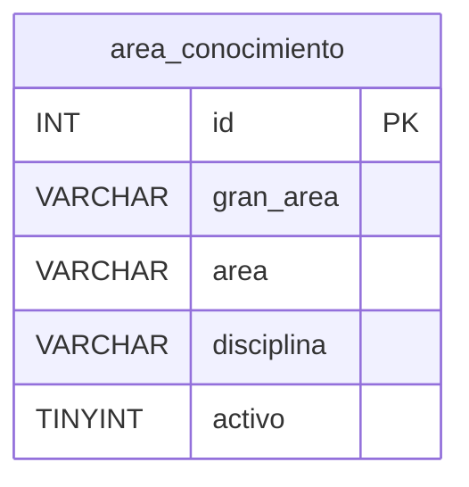
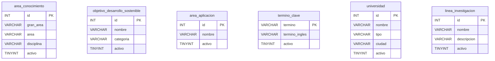

# Modelo de datos — v1: Investigación (MariaDB)

## 1. Las tablas de la versión 1

La versión 1 trabaja con seis tablas principales:

1. `area_conocimiento`
2. `objetivo_desarrollo_sostenible`
3. `area_aplicacion`
4. `termino_clave`
5. `universidad`
6. `linea_investigacion`

Estas tablas se implementan como CRUD independientes durante la v1.

Las relaciones entre las entidades y las tablas adicionales del modelo completo
se trabajarán en las siguientes versiones, principalmente en v2.

---

## 2. `area_conocimiento`

| Columna | Tipo | Restricciones |
|---|---|---|
| `id` | `INT` | **Llave primaria**, no nulo |
| `gran_area` | `VARCHAR(60)` | No nulo |
| `area` | `VARCHAR(60)` | No nulo |
| `disciplina` | `VARCHAR(60)` | No nulo |
| `activo` | `TINYINT(1)` | No nulo, por defecto `1` — **agregada**, ver §8 |



La tabla contiene la clasificación jerárquica del conocimiento:

```text
gran_area
    └── area
          └── disciplina
```

La información inicial contiene **218 registros** provenientes de los datos de
referencia suministrados para el proyecto.

---

## 3. `objetivo_desarrollo_sostenible`

| Columna | Tipo | Restricciones |
|---|---|---|
| `id` | `INT` | **Llave primaria**, no nulo |
| `nombre` | `VARCHAR(60)` | No nulo |
| `categoria` | `VARCHAR(45)` | No nulo |
| `activo` | `TINYINT(1)` | No nulo, por defecto `1` — **agregada**, ver §8 |

La tabla contiene los Objetivos de Desarrollo Sostenible utilizados por el
proyecto.

La carga inicial contiene **17 registros**.

La categoría permite clasificar cada objetivo según la información definida
para el proyecto.

---

## 4. `area_aplicacion`

| Columna | Tipo | Restricciones |
|---|---|---|
| `id` | `INT` | **Llave primaria**, no nulo |
| `nombre` | `VARCHAR(60)` | No nulo |
| `activo` | `TINYINT(1)` | No nulo, por defecto `1` — **agregada**, ver §8 |

La tabla representa las áreas o sectores de aplicación utilizados por el
proyecto.

La información inicial contiene **21 registros**.

---

## 5. `termino_clave`

| Columna | Tipo | Restricciones |
|---|---|---|
| `termino` | `VARCHAR(30)` | **Llave primaria**, no nulo |
| `termino_ingles` | `VARCHAR(30)` | Puede ser nulo |
| `activo` | `TINYINT(1)` | No nulo, por defecto `1` — **agregada**, ver §8 |

En esta tabla el identificador es el propio término.

No se agrega un campo `id` durante la v1 porque el esquema original define:

```sql
PRIMARY KEY (`termino`)
```

Por lo tanto, `termino` continúa siendo la clave primaria.

> [!NOTE]
> Los valores que contengan espacios o caracteres especiales deberán ser
> codificados correctamente cuando formen parte de una URL.

---

## 6. `universidad`

| Columna | Tipo | Restricciones |
|---|---|---|
| `id` | `INT` | **Llave primaria**, no nulo |
| `nombre` | `VARCHAR(60)` | No nulo |
| `tipo` | `VARCHAR(45)` | No nulo |
| `ciudad` | `VARCHAR(45)` | No nulo |
| `activo` | `TINYINT(1)` | No nulo, por defecto `1` — **agregada**, ver §8 |

La tabla contiene las universidades o instituciones de educación superior
definidas en los datos de referencia del proyecto.

La información inicial contiene **6 registros**.

---

## 7. `linea_investigacion`

| Columna | Tipo | Restricciones |
|---|---|---|
| `id` | `INT` | **Llave primaria**, `AUTO_INCREMENT`, no nulo |
| `nombre` | `VARCHAR(45)` | No nulo |
| `descripcion` | `VARCHAR(256)` | No nulo |
| `activo` | `TINYINT(1)` | No nulo, por defecto `1` — **agregada**, ver §8 |

A diferencia de las tablas anteriores, `linea_investigacion.id` utiliza
`AUTO_INCREMENT`.

Por esta razón, el cliente **no debe enviar el `id`** al crear una nueva línea
de investigación.

El identificador será generado por MariaDB.

---

## 8. Los cambios que SÍ se aplican en v1

El esquema SQL proporcionado para el proyecto es el punto de partida de la
base de datos.

No se deben modificar arbitrariamente las columnas existentes, ya que los
nombres y tipos forman parte del contrato del proyecto.

El cambio estructural necesario para cumplir el requisito de eliminación
lógica es agregar el campo `activo` a las seis tablas de la v1.

| Cambio | Tabla | Motivo |
|---|---|---|
| C1 | `area_conocimiento` | Agregar `activo` para soportar eliminación lógica |
| C2 | `objetivo_desarrollo_sostenible` | Agregar `activo` para soportar eliminación lógica |
| C3 | `area_aplicacion` | Agregar `activo` para soportar eliminación lógica |
| C4 | `termino_clave` | Agregar `activo` para soportar eliminación lógica |
| C5 | `universidad` | Agregar `activo` para soportar eliminación lógica |
| C6 | `linea_investigacion` | Agregar `activo` para soportar eliminación lógica |

El campo deberá crearse con una estructura equivalente a:

```sql
`activo` TINYINT(1) NOT NULL DEFAULT 1
```

Estos cambios deben quedar reflejados en `db/init.sql`.

---

## 9. Lo que el esquema dado tiene y no se corrige

El SQL inicial entregado para el proyecto se considera el **esquema de referencia**.

Durante la v1 no se deben cambiar arbitrariamente nombres de columnas,
tipos de datos o claves existentes solamente para mejorar el diseño.

Por ejemplo, en el esquema completo existen nombres que presentan posibles
errores de digitación, como:

```text
universidsad
nacionalidaad
```

Estos nombres pertenecen al esquema proporcionado y se conservarán tal como
están cuando se implementen esas tablas en las versiones correspondientes.

No se deben corregir durante v1 porque esas columnas no pertenecen a las seis
tablas principales de esta versión.

De esta manera se evita que el código PHP, el SQL proporcionado y la
documentación terminen utilizando nombres diferentes.

---

## 10. `activo` no es un campo editable del modelo

Aunque `activo` exista físicamente en las tablas de la base de datos, no se
considera un campo que el usuario pueda modificar libremente mediante los
formularios normales.

El campo `activo` se utiliza para controlar el estado lógico del registro.

La aplicación debe evitar que el frontend envíe algo como:

```json
{
    "nombre": "Ejemplo",
    "activo": 0
}
```

como mecanismo normal para eliminar un registro.

La eliminación lógica tendrá una operación específica mediante `DELETE`.

Conceptualmente:

```http
DELETE /api/area_conocimiento/10
```

produce una operación equivalente a:

```sql
UPDATE area_conocimiento
SET activo = 0
WHERE id = 10;
```

El registro permanece físicamente en la base de datos.

---

## 11. Regla para las consultas

Las consultas normales de la API deberán trabajar únicamente con registros
activos.

Ejemplo:

```sql
SELECT *
FROM area_conocimiento
WHERE activo = 1;
```

Una consulta individual también deberá respetar el estado:

```sql
SELECT *
FROM area_conocimiento
WHERE id = :id
  AND activo = 1;
```

Por lo tanto, un registro eliminado lógicamente no deberá aparecer en los
listados ni en las consultas normales.

---

## 12. Las semillas

Los datos iniciales de las tablas de la v1 deberán cargarse antes del cierre
de la versión.

Los datos conocidos son:

| Tabla | Registros iniciales |
|---|---|
| `area_conocimiento` | 218 |
| `objetivo_desarrollo_sostenible` | 17 |
| `area_aplicacion` | 21 |
| `termino_clave` | Según datos de referencia |
| `universidad` | 6 |
| `linea_investigacion` | Según datos definidos para el proyecto |

Los datos de referencia deberán quedar documentados en el archivo de
inicialización correspondiente.

La carga de datos no debe realizarse únicamente desde el frontend.

La base de datos debe poder inicializarse con los datos necesarios para que
los CRUD puedan probarse desde el comienzo.

---

## 13. Quién escribe qué

### `area_conocimiento`

| Dato | Dueño | La API… |
|---|---|---|
| `id` | Cliente/API | Lo recibe en POST y lo utiliza como identificador. No se modifica en PUT/PATCH |
| `gran_area` | API | Lo escribe en POST, PUT y PATCH |
| `area` | API | Lo escribe en POST, PUT y PATCH |
| `disciplina` | API | Lo escribe en POST, PUT y PATCH |
| `activo` | API | Solo lo modifica mediante eliminación lógica |

### `objetivo_desarrollo_sostenible`

| Dato | Dueño | La API… |
|---|---|---|
| `id` | Cliente/API | Lo recibe en POST y lo utiliza como identificador. No se modifica en PUT/PATCH |
| `nombre` | API | Lo escribe en POST, PUT y PATCH |
| `categoria` | API | Lo escribe en POST, PUT y PATCH |
| `activo` | API | Solo lo modifica mediante eliminación lógica |

### `area_aplicacion`

| Dato | Dueño | La API… |
|---|---|---|
| `id` | Cliente/API | Lo recibe en POST y lo utiliza como identificador. No se modifica en PUT/PATCH |
| `nombre` | API | Lo escribe en POST, PUT y PATCH |
| `activo` | API | Solo lo modifica mediante eliminación lógica |

### `termino_clave`

| Dato | Dueño | La API… |
|---|---|---|
| `termino` | Cliente/API | Identifica el registro y no debe cambiarse durante una actualización |
| `termino_ingles` | API | Lo escribe en POST, PUT y PATCH |
| `activo` | API | Solo lo modifica mediante eliminación lógica |

### `universidad`

| Dato | Dueño | La API… |
|---|---|---|
| `id` | Cliente/API | Lo recibe en POST y lo utiliza como identificador. No se modifica en PUT/PATCH |
| `nombre` | API | Lo escribe en POST, PUT y PATCH |
| `tipo` | API | Lo escribe en POST, PUT y PATCH |
| `ciudad` | API | Lo escribe en POST, PUT y PATCH |
| `activo` | API | Solo lo modifica mediante eliminación lógica |

### `linea_investigacion`

| Dato | Dueño | La API… |
|---|---|---|
| `id` | MariaDB | Lo genera mediante `AUTO_INCREMENT` |
| `nombre` | API | Lo escribe en POST, PUT y PATCH |
| `descripcion` | API | Lo escribe en POST, PUT y PATCH |
| `activo` | API | Solo lo modifica mediante eliminación lógica |

---

## 14. Las demás tablas

La base de datos completa contiene tablas adicionales que no forman parte de
los seis CRUD principales de la v1.

Entre ellas se encuentran:

- `docente`
- `grupo_investigacion`
- `semillero`
- `participa_semillero`
- `participa_grupo`
- `semillero_linea`
- `grupo_linea`
- `ac_linea`
- `ods_linea`
- `aa_linea`
- `rol`
- `usuario`
- `rol_usuario`

Estas tablas no serán desarrolladas como CRUD completos durante la primera
etapa.

Su implementación se realizará de acuerdo con el alcance definido para las
versiones posteriores.

En particular:

- las relaciones principales se desarrollarán en **v2**;
- `usuario`, `rol` y `rol_usuario` se utilizarán para autenticación y
  autorización en **v3**;
- las consultas avanzadas y el dashboard se desarrollarán en **v4**.

---

## 15. Relaciones futuras

Durante v1 se mantiene el enfoque de CRUD independientes.

En v2 se utilizarán las claves foráneas definidas en el modelo completo.

Algunas relaciones importantes serán:

<!-- TODO: agregar aquí el diagrama o la lista de relaciones -->

Estas relaciones no forman parte del CRUD independiente de la v1.

---

## 16. Regla general de integridad

Las claves primarias existentes en el SQL oficial se mantienen.

En v1:

- no se cambian las claves primarias existentes sin una decisión documentada;
- no se agregan relaciones nuevas entre las seis tablas;
- no se eliminan columnas del esquema;
- no se renombran columnas existentes;
- se agrega únicamente `activo` como cambio estructural necesario para la
  eliminación lógica;
- se respetan los tipos y tamaños definidos por el esquema de referencia.

---

## 17. Modelo físico de la v1

El modelo físico de las seis tablas de v1 puede representarse de la siguiente
manera:



Durante v1 estas seis tablas se consideran **independientes** desde el punto de
vista de los CRUD.

Las relaciones del modelo completo serán utilizadas en las siguientes
versiones.

---

## 18. Criterio de cierre del modelo de datos de v1

El modelo de datos de v1 se considerará listo cuando:

- [ ] existan las seis tablas requeridas;
- [ ] las columnas correspondan al esquema definido;
- [ ] se haya agregado `activo` a las seis tablas;
- [ ] `activo` tenga valor por defecto `1`;
- [ ] las claves primarias funcionen correctamente;
- [ ] los datos de referencia estén cargados;
- [ ] los registros puedan crearse mediante la API;
- [ ] los registros puedan actualizarse mediante la API;
- [ ] los registros puedan eliminarse lógicamente;
- [ ] las consultas normales filtren `activo = 1`;
- [ ] el frontend pueda consumir correctamente estas estructuras.

El cierre del modelo de datos debe ser compatible con el cierre general de la
versión v1.
